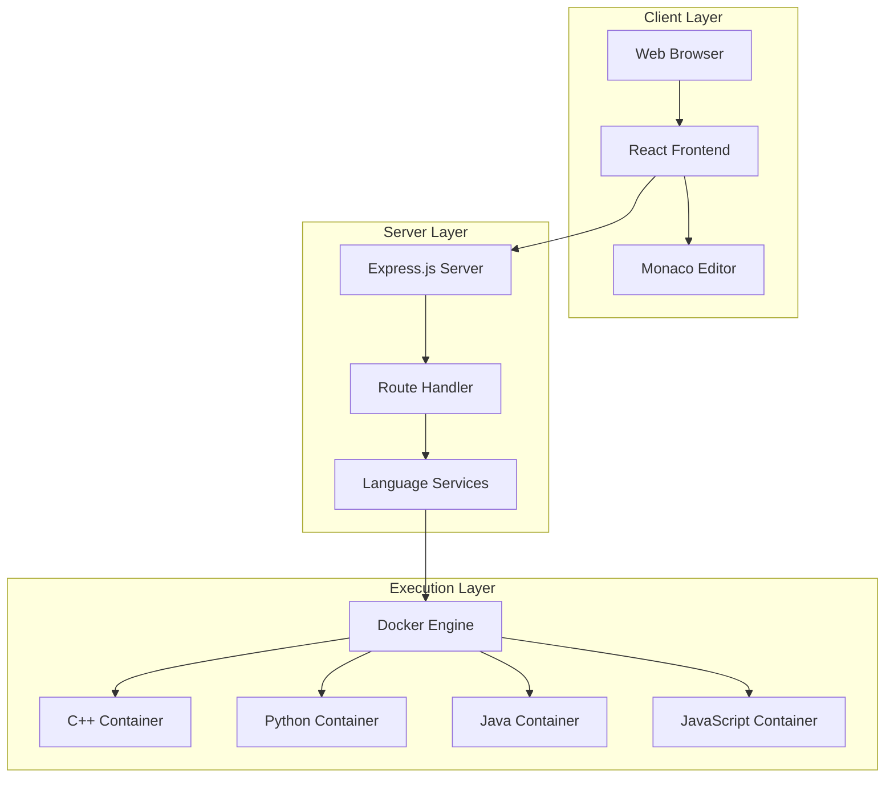
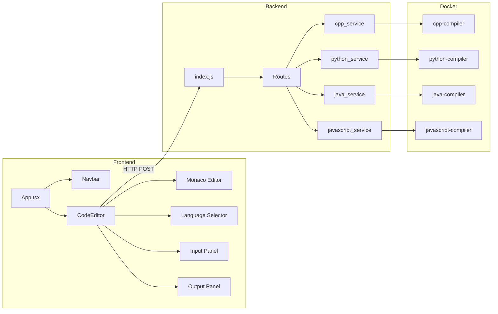
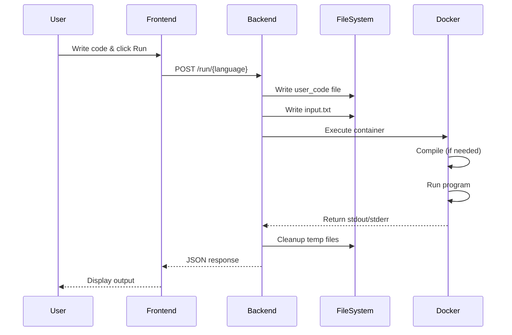
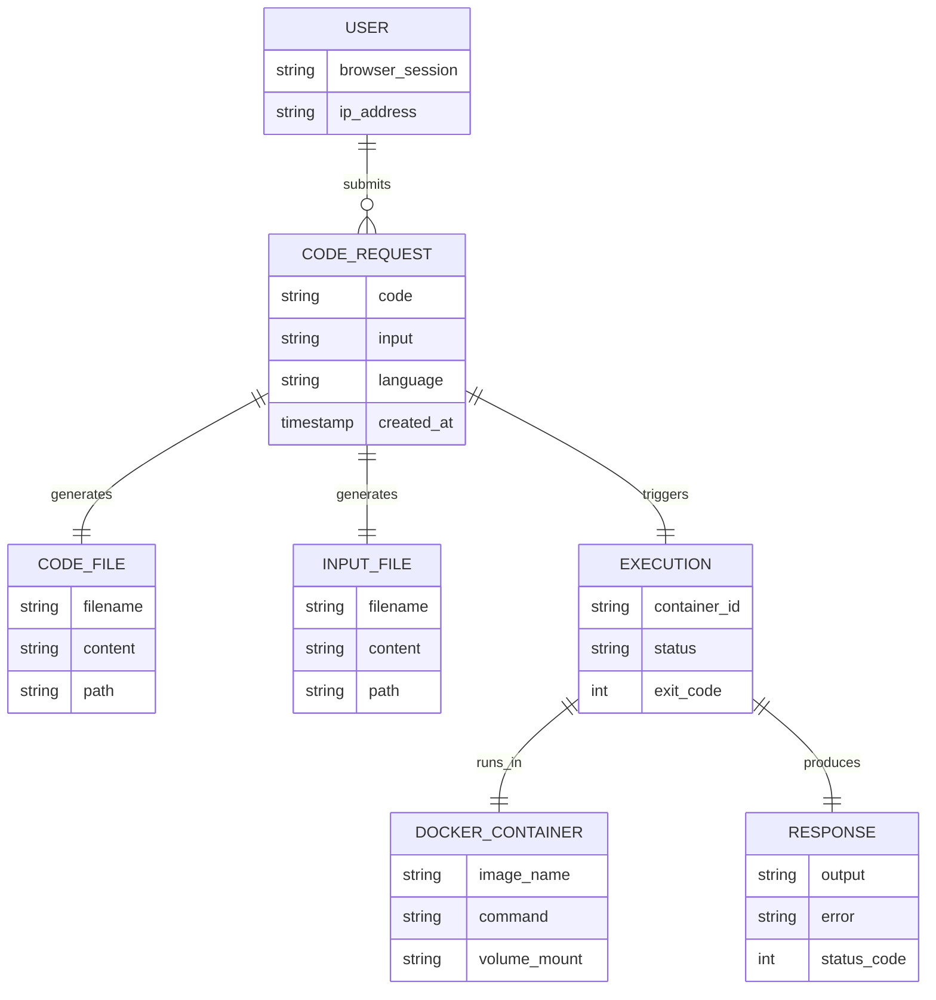
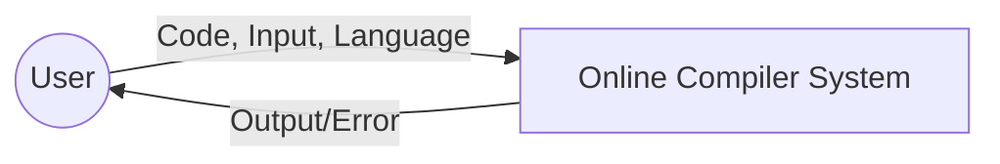
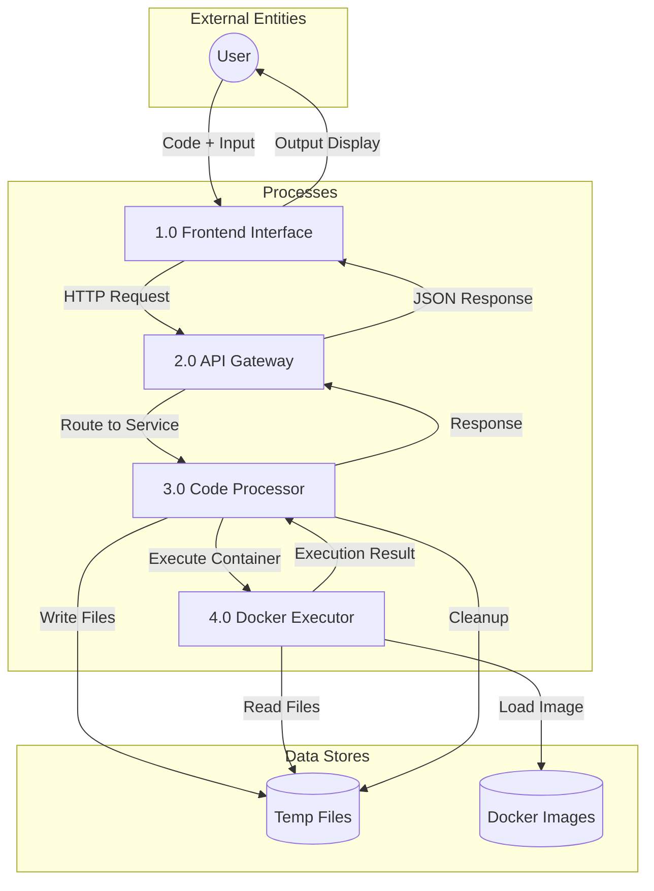
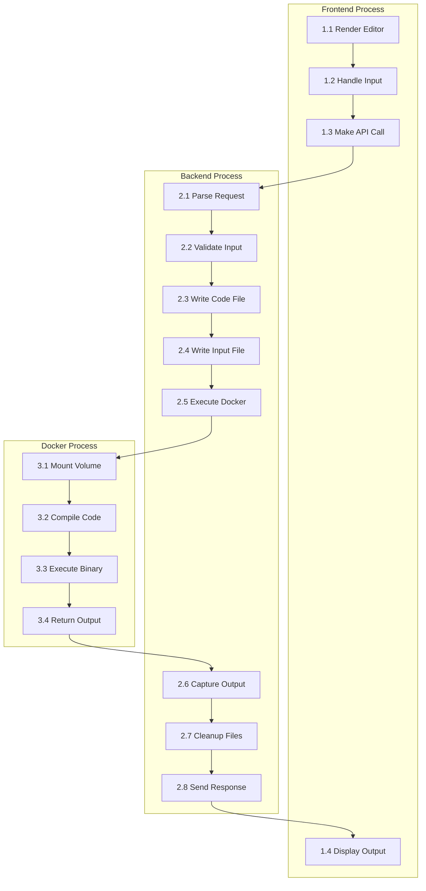
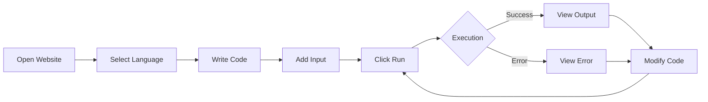
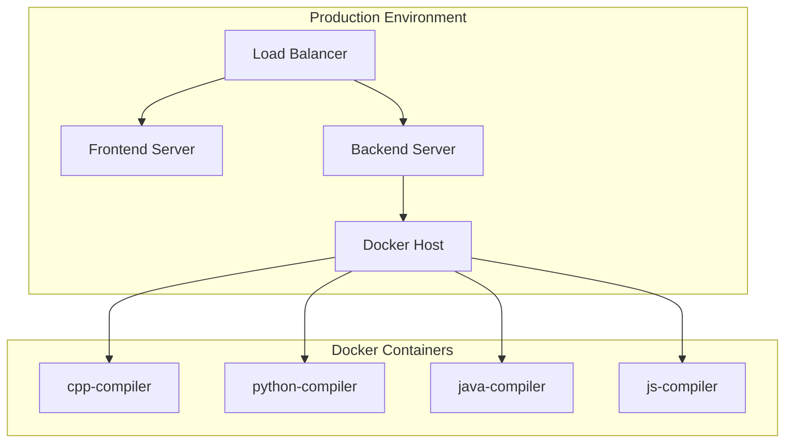

# Online Compiler - Project Report

---

## Table of Contents

1. [Introduction](#1-introduction)
2. [Background and Related Work](#2-background-and-related-work)
3. [System Analysis and Design](#3-system-analysis-and-design)
4. [ER Diagram](#4-er-diagram)
5. [Data Flow Diagram](#5-data-flow-diagram)
6. [Implementation](#6-implementation)
7. [Testing](#7-testing)
8. [Database Description](#8-database-description)
9. [Conclusion and Discussion](#9-conclusion-and-discussion)

---

## 1. Introduction

### 1.1 Introduction

The **Online Compiler** is a modern web-based application that enables users to write, compile, and execute code in multiple programming languages directly from their web browser. This platform eliminates the need for users to install language-specific compilers, interpreters, or development environments on their local machines.

The application leverages containerization technology (Docker) to provide a secure, isolated, and consistent execution environment for user code. By running each code snippet in its own Docker container, the system ensures security, resource isolation, and consistent behavior across different executions.

The platform supports four major programming languages:

- **C++** - A powerful systems programming language
- **Python** - A versatile scripting and programming language
- **Java** - A robust object-oriented programming language
- **JavaScript** - The language of the web and Node.js runtime

### 1.2 Problem Definition

Traditional code development requires setting up local development environments, which presents several challenges:

1. **Complex Installation**: Installing compilers and interpreters can be time-consuming and error-prone, especially for beginners
2. **Version Conflicts**: Different projects may require different versions of compilers or runtimes
3. **Platform Dependencies**: Code that works on one operating system may not work on another
4. **Resource Intensive**: Running multiple development environments locally consumes significant system resources
5. **Accessibility Issues**: Users cannot quickly test code snippets without proper setup
6. **Security Concerns**: Running untrusted code on local machines poses security risks

### 1.3 Motivation

The motivation behind developing this Online Compiler stems from several factors:

1. **Educational Needs**: Students and beginners need a quick way to practice coding without complex setups
2. **Remote Learning**: With the rise of online education, there's a need for accessible coding platforms
3. **Quick Prototyping**: Developers often need to test small code snippets without setting up full projects
4. **Cross-Platform Accessibility**: Access code execution capabilities from any device with a web browser
5. **Standardized Environment**: Ensure consistent code execution regardless of the user's local setup
6. **Security through Isolation**: Docker containers provide sandboxed execution environments

### 1.4 Objective

The primary objectives of this project are:

1. **Multi-Language Support**: Provide compilation and execution support for C++, Python, Java, and JavaScript
2. **User-Friendly Interface**: Create an intuitive web interface with syntax highlighting and code editing features
3. **Secure Execution**: Implement Docker-based containerization for isolated code execution
4. **Real-Time Output**: Display execution results and errors in real-time
5. **Input Handling**: Support standard input for interactive programs
6. **Resource Management**: Automatically clean up temporary files and containers after execution
7. **Scalable Architecture**: Design a modular system that can be easily extended to support additional languages

### 1.5 Proposed Solution

The proposed solution is a three-tier web application consisting of:

1. **Frontend Layer**: A React.js-based single-page application (SPA) with:

   - Monaco Editor for professional code editing experience
   - Language selection dropdown
   - Input textarea for program inputs
   - Output display panel for execution results

2. **Backend Layer**: A Node.js/Express.js server that:

   - Receives code and input from the frontend
   - Manages file operations (writing code to files)
   - Orchestrates Docker container execution
   - Returns execution output or errors to the frontend

3. **Execution Layer**: Docker containers for each language that:
   - Compile (if applicable) and execute user code
   - Provide isolated and secure execution environments
   - Handle input/output redirection
   - Automatically terminate after execution

### 1.6 Platform Specification

#### 1.6.1 Hardware Specification

| Component | Minimum Requirement  | Recommended             |
| --------- | -------------------- | ----------------------- |
| Processor | Dual-core CPU        | Quad-core CPU or higher |
| RAM       | 4 GB                 | 8 GB or higher          |
| Storage   | 10 GB free space     | 20 GB SSD               |
| Network   | Broadband connection | High-speed internet     |

#### 1.6.2 Software Specification

| Software         | Version                        | Purpose                   |
| ---------------- | ------------------------------ | ------------------------- |
| Operating System | Windows 10/11, Linux, macOS    | Host system               |
| Docker Desktop   | Latest stable                  | Containerization platform |
| Node.js          | v18.x or higher                | Backend runtime           |
| npm              | v9.x or higher                 | Package management        |
| Web Browser      | Chrome, Firefox, Edge (Latest) | Frontend access           |

#### 1.6.3 Tools and Technology

| Category           | Technology      | Description                   |
| ------------------ | --------------- | ----------------------------- |
| Frontend Framework | React.js 19.x   | UI component library          |
| Build Tool         | Vite 7.x        | Fast frontend build tool      |
| Code Editor        | Monaco Editor   | VS Code's editor component    |
| Language           | TypeScript 5.x  | Type-safe JavaScript          |
| Backend Framework  | Express.js 5.x  | Node.js web framework         |
| Containerization   | Docker          | Container platform            |
| HTTP Client        | Fetch API       | Browser HTTP requests         |
| CORS               | cors middleware | Cross-origin resource sharing |

### 1.7 Scope and Marketing

**Scope:**

The Online Compiler is designed for:

- **Students**: Learning programming languages without setup hassles
- **Educators**: Demonstrating code concepts in classrooms
- **Developers**: Quick code testing and prototyping
- **Interview Platforms**: Technical interview coding challenges
- **Coding Competitions**: Practice and competition environments

**Market Potential:**

- Educational institutions worldwide
- Online coding bootcamps
- Corporate training programs
- Competitive programming platforms
- Technical recruitment platforms

---

## 2. Background and Related Work

### 2.1 Existing System

Several online compiler platforms exist in the market:

| Platform      | Features                      | Limitations                         |
| ------------- | ----------------------------- | ----------------------------------- |
| **Replit**    | Multi-language, collaborative | Requires account, limited free tier |
| **JDoodle**   | Simple interface, API access  | Limited customization               |
| **OnlineGDB** | Debugging support             | Slower execution                    |
| **Ideone**    | Pastebin integration          | Limited editor features             |
| **CodePen**   | Frontend-focused              | No backend language support         |

**Common Limitations of Existing Systems:**

1. Require user registration
2. Limited free execution time
3. No local deployment option
4. Privacy concerns with cloud execution
5. Limited customization options
6. Dependency on third-party services

### 2.2 Proposed System

The proposed Online Compiler addresses the limitations of existing systems:

**Key Differentiators:**

1. **Self-Hosted Solution**: Can be deployed on private infrastructure
2. **No Registration Required**: Anonymous code execution
3. **Open Source**: Fully customizable and extensible
4. **Docker-Based**: Consistent and isolated execution
5. **Modern Tech Stack**: Uses latest technologies for better performance
6. **Privacy-Focused**: Code stays within your infrastructure
7. **RESTful API**: Easy integration with other systems

**System Architecture:**



### 2.3 Scope of Proposed System

**Current Scope:**

- Support for C++, Python, Java, and JavaScript
- Real-time code execution
- Standard input/output handling
- Syntax highlighting with Monaco Editor
- Dark theme interface
- RESTful API endpoints

**Future Expansion:**

- Additional language support (Go, Rust, Ruby, PHP)
- User authentication and code saving
- Code sharing and collaboration
- Execution time limits and resource quotas
- Multiple file support
- Library/package installation
- Code templates and snippets

---

## 3. System Analysis and Design

### 3.1 Feasibility Study

#### 3.1.1 Technical Feasibility

| Aspect                      | Analysis                                          | Status      |
| --------------------------- | ------------------------------------------------- | ----------- |
| **Docker Support**          | Docker is widely supported on all major platforms | ✅ Feasible |
| **Node.js Ecosystem**       | Mature ecosystem with excellent package support   | ✅ Feasible |
| **React.js**                | Industry-standard frontend framework              | ✅ Feasible |
| **Monaco Editor**           | Well-documented VS Code editor component          | ✅ Feasible |
| **Container Orchestration** | Docker provides reliable container management     | ✅ Feasible |
| **Cross-Platform**          | Web-based solution works on all platforms         | ✅ Feasible |

**Conclusion**: The project is technically feasible with modern, well-supported technologies.

#### 3.1.2 Economical Feasibility

| Factor                | Cost Analysis                     |
| --------------------- | --------------------------------- |
| **Development Tools** | Free (Open Source)                |
| **Docker**            | Free for personal/small-scale use |
| **Node.js**           | Free (Open Source)                |
| **React.js**          | Free (Open Source)                |
| **Monaco Editor**     | Free (MIT License)                |
| **Hosting**           | Variable (Self-hosted or cloud)   |
| **Development Time**  | ~2-4 weeks for MVP                |

**Cost Breakdown for Deployment:**

| Deployment Option               | Monthly Cost |
| ------------------------------- | ------------ |
| Self-hosted (existing hardware) | $0           |
| Cloud VPS (2GB RAM)             | $5-10        |
| Cloud VPS (4GB RAM)             | $20-40       |
| Enterprise Cloud                | $100+        |

**Conclusion**: The project is economically feasible with minimal to no licensing costs.

#### 3.1.3 Operational Feasibility

| Criteria          | Assessment                                  |
| ----------------- | ------------------------------------------- |
| **User Training** | Minimal - intuitive interface               |
| **Maintenance**   | Low - automated container cleanup           |
| **Scalability**   | High - Docker enables easy scaling          |
| **Reliability**   | High - container isolation prevents crashes |
| **Security**      | High - sandboxed execution environment      |

**Conclusion**: The system is operationally feasible with low maintenance requirements.

### 3.2 Non-Functional Requirements

| Requirement         | Description                  | Target                          |
| ------------------- | ---------------------------- | ------------------------------- |
| **Performance**     | Code execution response time | < 5 seconds for simple programs |
| **Availability**    | System uptime                | 99.5%                           |
| **Scalability**     | Concurrent users support     | 50+ simultaneous executions     |
| **Security**        | Isolated code execution      | Docker container sandboxing     |
| **Usability**       | User interface intuitiveness | < 1 minute learning curve       |
| **Maintainability** | Modular code architecture    | Separate services per language  |
| **Portability**     | Cross-platform support       | All modern browsers             |
| **Reliability**     | Error handling               | Graceful error messages         |

### 3.3 Functional Requirements

| ID   | Requirement         | Description                             | Priority |
| ---- | ------------------- | --------------------------------------- | -------- |
| FR01 | Code Input          | User can write/paste code in the editor | High     |
| FR02 | Language Selection  | User can select programming language    | High     |
| FR03 | Code Execution      | System compiles and runs the code       | High     |
| FR04 | Output Display      | System displays execution output        | High     |
| FR05 | Error Display       | System shows compilation/runtime errors | High     |
| FR06 | Input Handling      | User can provide standard input         | Medium   |
| FR07 | Syntax Highlighting | Editor highlights code syntax           | Medium   |
| FR08 | Default Templates   | Pre-filled code templates per language  | Low      |
| FR09 | File Upload         | User can upload code files              | Low      |

### 3.4 Design

**Component Architecture:**



**Sequence Diagram - Code Execution Flow:**



---

## 4. ER Diagram

Since this application does not use a traditional database and operates in a stateless manner, the data model focuses on the request/response structure and file relationships:
 


---

## 5. Data Flow Diagram

### Level 0 - Context Diagram



### Level 1 - High-Level DFD



### Level 2 - Detailed DFD



---

## 6. Implementation

### 6.1 Implementation

The Online Compiler is implemented using a modern microservices-inspired architecture:

**Frontend Implementation:**

| File              | Purpose                                       |
| ----------------- | --------------------------------------------- |
| `App.tsx`         | Root component, renders Navbar and CodeEditor |
| `navbar.tsx`      | Navigation bar with branding                  |
| `code_editor.tsx` | Main editor component with Monaco Editor      |

**Key Frontend Features:**

```typescript
// Language type definition
type LanguageKey = "cpp" | "python" | "javascript" | "java";

// Default code templates for each language
const DEFAULT_CODE: Record<LanguageKey, string> = {
  cpp: "#include <bits/stdc++.h>\nusing namespace std;\nint main() {...}",
  python: 'print("Hello, World!")',
  javascript: 'console.log("Hello, World!")',
  java: "public class user_code { public static void main(String[] args) {...} }",
};
```

**Backend Implementation:**

| File                    | Purpose                             |
| ----------------------- | ----------------------------------- |
| `index.js`              | Express server setup, CORS, routing |
| `run_code_route.js`     | Route definitions for each language |
| `cpp_service.js`        | C++ code execution handler          |
| `python_service.js`     | Python code execution handler       |
| `java_service.js`       | Java code execution handler         |
| `javascript_service.js` | JavaScript code execution handler   |

**Docker Implementation:**

Each language has a dedicated Dockerfile:

| Language   | Base Image           | Compilation Command                       |
| ---------- | -------------------- | ----------------------------------------- |
| C++        | `alpine:latest`      | `g++ -o output user_code.cpp && ./output` |
| Python     | `python:3.11-slim`   | `python user_code.py`                     |
| Java       | `openjdk:26-ea-slim` | `javac user_code.java && java user_code`  |
| JavaScript | `node:latest`        | `node user_code.js`                       |

### 6.2 History and Feature

**Version History:**

| Version | Features Added                                             |
| ------- | ---------------------------------------------------------- |
| 1.0.0   | Initial release with C++, Python, Java, JavaScript support |
| -       | Monaco Editor integration                                  |
| -       | Docker containerization                                    |
| -       | Input handling support                                     |
| -       | Real-time output display                                   |

**Current Features:**

1. **Multi-Language Support**

   - C++ with GCC compiler
   - Python 3.11 interpreter
   - Java 26 JDK
   - Node.js JavaScript runtime

2. **Code Editor**

   - Syntax highlighting
   - Line numbers
   - Minimap
   - Auto-indentation
   - Dark theme

3. **Execution Environment**
   - Isolated Docker containers
   - Automatic cleanup
   - Error handling
   - Input redirection

### 6.3 Application

The Online Compiler can be used for:

1. **Educational Purposes**

   - Teaching programming concepts
   - Student practice assignments
   - Code demonstrations

2. **Development**

   - Quick code testing
   - Algorithm prototyping
   - Syntax verification

3. **Recruitment**

   - Technical interviews
   - Coding assessments
   - Skill evaluation

4. **Competitive Programming**
   - Practice sessions
   - Contest simulations
   - Solution testing

### 6.4 Screenshots with Detail

**Screenshot 1: Main Interface**

The main interface consists of:

- **Header**: Navigation bar with application title
- **Editor Panel**: Monaco-based code editor on the left
- **Control Bar**: Language selector and Run button
- **I/O Panel**: Input textarea and output display on the right

```
┌─────────────────────────────────────────────────────────────┐
│  Online Compiler                                            │
├─────────────────────────────────────────────────────────────┤
│                                        [C++  ▼] [  Run  ]   │
├────────────────────────────────┬────────────────────────────┤
│                                │  Input                     │
│  // Write your C++ code here   │  ┌────────────────────────┐│
│  #include <bits/stdc++.h>      │  │                        ││
│  using namespace std;          │  │                        ││
│  int main() {                  │  └────────────────────────┘│
│      cout << "Hello!" << endl; │                            │
│      return 0;                 │  Output                    │
│  }                             │  ┌────────────────────────┐│
│                                │  │ Hello!                 ││
│                                │  │                        ││
│                                │  └────────────────────────┘│
└────────────────────────────────┴────────────────────────────┘
```

**Screenshot 2: Language Selection**

The dropdown menu allows users to select from:

- C++
- Python
- JavaScript
- Java

**Screenshot 3: Code Execution**

When the "Run" button is clicked:

1. Button changes to "Running..." state
2. Code is sent to the backend
3. Output appears in the output panel

**Screenshot 4: Error Handling**

Compilation or runtime errors are displayed in the output panel with error messages from the compiler/interpreter.

---

## 7. Testing

### 7.1 Test Steps

**Testing Procedure:**

1. **Unit Testing**

   - Test individual service functions
   - Verify file operations
   - Check Docker command execution

2. **Integration Testing**

   - Test API endpoints
   - Verify request/response flow
   - Check frontend-backend communication

3. **System Testing**

   - End-to-end code execution
   - Multiple language testing
   - Error handling verification

4. **User Acceptance Testing**
   - Interface usability
   - Response time
   - Output accuracy

### 7.2 Test Cases

| Test ID | Test Case             | Input                       | Expected Output      | Status  |
| ------- | --------------------- | --------------------------- | -------------------- | ------- |
| TC001   | C++ Hello World       | `cout << "Hello";`          | `Hello`              | ✅ Pass |
| TC002   | Python Print          | `print("Test")`             | `Test`               | ✅ Pass |
| TC003   | Java Main             | `System.out.println("Hi");` | `Hi`                 | ✅ Pass |
| TC004   | JS Console            | `console.log("JS")`         | `JS`                 | ✅ Pass |
| TC005   | C++ Compilation Error | `int main( {`               | Error message        | ✅ Pass |
| TC006   | Python Runtime Error  | `print(x)`                  | NameError            | ✅ Pass |
| TC007   | C++ with Input        | `cin >> n;` + input "5"     | Uses input           | ✅ Pass |
| TC008   | Python with Input     | `input()` + input "test"    | Uses input           | ✅ Pass |
| TC009   | Empty Code            | ``                          | No output            | ✅ Pass |
| TC010   | Large Output          | Loop 1000 times             | All output displayed | ✅ Pass |
| TC011   | Language Switch       | Change C++ to Python        | Template updates     | ✅ Pass |
| TC012   | API 404               | Invalid endpoint            | Not found error      | ✅ Pass |

**Performance Test Results:**

| Language   | Simple Program | Complex Program |
| ---------- | -------------- | --------------- |
| C++        | ~1.5s          | ~3s             |
| Python     | ~1.2s          | ~2.5s           |
| Java       | ~2s            | ~4s             |
| JavaScript | ~1s            | ~2s             |

---

## 8. Database Description

### 8.1 List of Tables

This application uses a **stateless architecture** and does not employ a traditional database. Instead, it uses temporary file storage:

| Storage Type         | Location                    | Purpose                     |
| -------------------- | --------------------------- | --------------------------- |
| Temporary Code File  | `/services/user_code.{ext}` | Store user's source code    |
| Temporary Input File | `/services/input.txt`       | Store user's input          |
| Docker Volume Mount  | Container → Host mapping    | Share files with containers |

### 8.2 Structure of Table

**Request Data Structure:**

```json
{
  "code": "string",
  "input": "string (optional)"
}
```

**Response Data Structure:**

```json
{
  "output": "string"
}
```

**Error Response Structure:**

```json
{
  "error": "string"
}
```

**File System Structure:**

| File             | Format            | Content                                  |
| ---------------- | ----------------- | ---------------------------------------- |
| `user_code.cpp`  | C++ source        | User's C++ code                          |
| `user_code.py`   | Python source     | User's Python code                       |
| `user_code.java` | Java source       | User's Java code (class name: user_code) |
| `user_code.js`   | JavaScript source | User's JavaScript code                   |
| `input.txt`      | Plain text        | Standard input for the program           |

---

## 9. Conclusion and Discussion

### 9.1 Conclusion and Discussion

The **Online Compiler** project successfully achieves its objectives of providing a secure, accessible, and user-friendly platform for code compilation and execution. Key achievements include:

1. **Multi-Language Support**: Successfully implemented support for C++, Python, Java, and JavaScript with dedicated Docker containers for each language.

2. **Security**: Docker containerization ensures that user code runs in isolated environments, preventing any potential security risks to the host system.

3. **User Experience**: The Monaco Editor integration provides a professional coding experience with syntax highlighting, line numbers, and auto-indentation.

4. **Modern Architecture**: The separation of frontend (React), backend (Express), and execution (Docker) layers follows modern microservices principles.

5. **Simplicity**: The RESTful API design allows for easy integration and potential future expansion.

**Challenges Overcome:**

- Docker volume mounting for file sharing
- Handling compilation errors gracefully
- Managing container lifecycle
- Cross-origin resource sharing (CORS)

### 9.2 Future Scope of the Project

| Enhancement               | Description                    | Priority |
| ------------------------- | ------------------------------ | -------- |
| **Additional Languages**  | Add Go, Rust, Ruby, PHP, C#    | High     |
| **User Authentication**   | Save and manage code snippets  | Medium   |
| **Code Sharing**          | Generate shareable links       | Medium   |
| **Execution Limits**      | Timeout and memory limits      | High     |
| **File Upload/Download**  | Import/export code files       | Low      |
| **Collaborative Editing** | Real-time multi-user editing   | Low      |
| **Code Templates**        | Predefined algorithm templates | Medium   |
| **Theme Customization**   | Light/dark mode toggle         | Low      |
| **Mobile Optimization**   | Responsive design improvements | Medium   |
| **API Rate Limiting**     | Prevent abuse                  | High     |
| **Execution History**     | Track past executions          | Medium   |
| **Package Support**       | Install npm/pip packages       | High     |

### 9.3 Snapshots

**Application Flow:**



**System Deployment:**



### 9.4 References

1. Docker Documentation - https://docs.docker.com/
2. Node.js Documentation - https://nodejs.org/docs/
3. Express.js Guide - https://expressjs.com/
4. React Documentation - https://react.dev/
5. Monaco Editor - https://microsoft.github.io/monaco-editor/
6. Vite Build Tool - https://vitejs.dev/
7. TypeScript Handbook - https://www.typescriptlang.org/docs/

### 9.5 Bibliography

1. Tanenbaum, A. S., & Van Steen, M. (2017). _Distributed Systems: Principles and Paradigms_. Pearson.
2. Richardson, C. (2018). _Microservices Patterns_. Manning Publications.
3. Turnbull, J. (2014). _The Docker Book_. James Turnbull.
4. Banks, A., & Porcello, E. (2020). _Learning React_. O'Reilly Media.
5. Brown, E. (2019). _Web Development with Node and Express_. O'Reilly Media.

### 9.6 Appendix

**A. API Endpoint Summary**

| Method | Endpoint          | Description             |
| ------ | ----------------- | ----------------------- |
| GET    | `/`               | Health check            |
| POST   | `/run/cpp`        | Execute C++ code        |
| POST   | `/run/python`     | Execute Python code     |
| POST   | `/run/java`       | Execute Java code       |
| POST   | `/run/javascript` | Execute JavaScript code |

**B. Docker Image Build Commands**

```bash
# Build C++ compiler image
docker build -t cpp-compiler ./dockerFiles/cppDocker

# Build Python compiler image
docker build -t python-compiler ./dockerFiles/pythonDocker

# Build Java compiler image
docker build -t java-compiler ./dockerFiles/javaDocker

# Build JavaScript compiler image
docker build -t javascript-compiler ./dockerFiles/javascriptDocker
```

**C. Project Setup Commands**

```bash
# Install backend dependencies
cd backend
npm install

# Install frontend dependencies
cd frontend
npm install

# Start backend server
cd backend
npm start

# Start frontend development server
cd frontend
npm run dev
```

**D. Project Directory Structure**

```
online_compiler/
├── backend/
│   ├── index.js
│   ├── package.json
│   ├── routes/
│   │   └── run_code_route.js
│   └── services/
│       ├── cpp_service.js
│       ├── python_service.js
│       ├── java_service.js
│       └── javascript_service.js
├── frontend/
│   ├── src/
│   │   ├── App.tsx
│   │   ├── main.tsx
│   │   └── component/
│   │       ├── code_editor.tsx
│   │       └── navbar.tsx
│   ├── package.json
│   └── vite.config.ts
└── dockerFiles/
    ├── cppDocker/
    │   └── Dockerfile
    ├── pythonDocker/
    │   └── Dockerfile
    ├── javaDocker/
    │   └── Dockerfile
    └── javascriptDocker/
        └── Dockerfile
```

---

_Report Generated: December 2025_

_Project: Online Compiler - A Dockerized Multi-Language Code Execution Platform_
